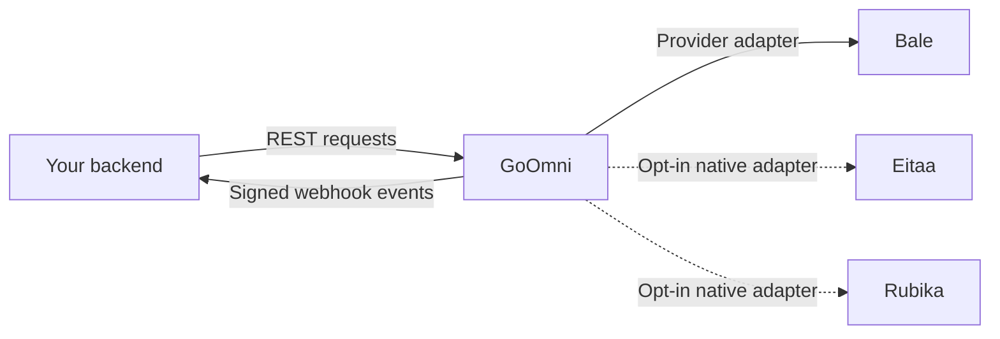

# GoOmni


[](https://github.com/mimalef70/goomni/actions/workflows/ci.yml)
[](https://github.com/mimalef70/goomni/releases)
[](LICENCE.txt)

**One self-hosted gateway for independent messenger accounts, REST APIs and signed webhooks.**

GoOmni is the multi-messenger evolution of GoBale, written in Go. Run one
service, manage independent account connections and use your application to send
messages and receive events. Bale is enabled by default. Native Eitaa and Rubika
adapters are opt-in while live acceptance is pending. Sessions, message history,
media and delivery queues stay on
your server. The administrative panel is included in the binary.

Sponsored by **[MuChat](https://mu.chat)**. GoOmni is independent open-source
software, available to everyone under the MIT license.

[Download binaries](https://github.com/mimalef70/goomni/releases) ·
[GHCR](https://github.com/users/mimalef70/packages/container/package/goomni) ·
[Docker Hub](https://hub.docker.com/r/mimalef70/goomni) ·
[API reference](https://mimalef70.github.io/goomni/) ·
[OpenAPI](docs/openapi.yaml)

## Contents

- [Features](#features)
- [Release status](#release-status)
- [How to use](#how-to-use)
- [Upgrade from GoBale](docs/upgrade-goomni.md)
- [Configuration](#configuration)
- [Connect your application](#connect-your-application)
- [Important behavior](#important-behavior)
- [Documentation and support](#documentation-and-support)
- [Development](#development)

## Features

The core account, queue, scheduling and webhook facilities are shared. Messaging
and account operations depend on the selected adapter: read its capability
response before offering a feature to your users. The Bale feature list is below;
Eitaa and Rubika have separate, explicit contracts and verification evidence.

- **Multiple accounts:** separate login sessions, peers, files and durable work for each connection.
- **Messaging:** text, images, files, audio, video and native Ogg Opus voice notes; replies, edits, forwards and reactions.
- **Scheduling:** one-time or daily, weekly and monthly sends, with pause/resume/cancel and per-execution results.
- **Signed webhooks:** per-account destinations, event/peer/sender filters, delivery history, retries and explicit replay.
- **Local queries:** search stored message events and inspect pending, completed or uncertain sends.
- **Account tools:** contacts, avatars, conversations, groups, polls and other documented provider operations.
- **Administrative panel:** English/Persian, account login, connection/recovery status and webhook management.
- **Operations:** encrypted sessions, restart recovery, bounded workers, health checks and Prometheus metrics.
- **Simple runtime:** one Go binary and SQLite; no browser, Node.js, Redis or PostgreSQL runtime dependency.

Your backend owns users, permissions and conversations. GoOmni manages the messenger
connections and delivery work. A user in your application can own several
connections; save that ownership mapping in your application's database.



The panel is for gateway administrators. It manages accounts and webhooks; it is
not a customer login page or a chat inbox.

## Release status

**GoOmni 2.3.0** continues GoBale with one native gateway for Bale, Eitaa and
Rubika. It includes the administrative panel, release archives for Linux/macOS
and container images for Linux amd64/arm64. This release changes the public
contract: update API and webhook consumers using the [upgrade guide](docs/upgrade-goomni.md).
Existing accounts and accepted work are preserved when you reuse the original
database, media and master key. Always use documentation from your installed tag.
The [acceptance record](docs/providers/acceptance.md) separates controlled native
tests from synthetic tests and pending capacity/recovery gates.

| Messenger | Current status |
| --- | --- |
| Bale | Enabled. Existing native features and limitations are preserved. |
| Eitaa | Native adapter, disabled by default; controlled two-account text/media and short-outage tests passed, with explicit remaining protocol limits. |
| Rubika | Native adapter, disabled by default; controlled two-account text/media and short-outage tests passed, with explicit remaining protocol limits. |

`GET /app/providers` reports enabled adapters and ordinary send support. Its
`send` object lists kinds, text/caption limits with explicit units, mention/reply
support and media format notes. `interactions` reports optional typing/presence
presets, read/receipt semantics, sender names, avatars and partial edits; missing
presets mean skip that feature. Eitaa typing/cancel is unavailable on the tested
server. [One integration contract](docs/consumer-integration.md#use-one-message-integration-across-providers)
covers all three providers, including safe handling of sparse edits. Bale limits text to 65,536 UTF-8 bytes; Eitaa and
Rubika allow 4,096 and 4,200 Unicode characters respectively. Operation support is
provider-specific: `GET /app/capabilities?provider=bale` and
`GET /devices/{id}/capabilities` describe reviewed contracts. A listed messenger
or a running gateway does not establish live protocol compatibility.

Enable the new adapters with `EITAA_ENABLED=true` and `RUBIKA_ENABLED=true` after
reviewing the [provider configuration and limits](docs/operations.md#provider-availability).
Run acceptance only with operator-controlled test accounts and recipients. The
[source inventories](docs/providers/sources.md) distinguish implementation,
synthetic evidence, excluded operations and unverified behavior.

This is an independent implementation, not an official messenger SDK. Bale core
login, messaging, media, voice and selected group operations were tested with two
authorized accounts; see the dated [Bale capability inventory](src/internal/balemeow/testdata/coverage/capabilities.json).
Mention rendering remains live-unverified. One-time scheduled forwarding was
acknowledged for all three providers in controlled tests; this does not establish
all recurrence or forwarding variants. Ordinary-user keyboard templates failed
live verification. Two-account live results, successful Eitaa native login and
remaining limitations are recorded in [acceptance](docs/providers/acceptance.md)
and the [operation response ledger](docs/providers/live-20261010.json).
Eitaa static location passed in both directions after correcting its wire layout.
Two- and five-second video samples retained video presentation; tested one-second
clips arrived as ordinary files. Its polls remain rejected. A controlled one-hour
process outage recovered all 75 test messages on both Eitaa/Rubika accounts;
multi-day gaps and exhaustive initial import remain unverified.
Rubika sender-contact cards passed in both directions
after correcting the receive layout; other card variants remain unverified. There is no live 300-account
capacity claim. Eitaa sticker/GIF and reaction methods intercepted locally by its
reviewed web client are excluded; a shared schema is not proof of server support.
Rubika attachment edits have an ordering limit: when conflicting private file
references cannot be ordered from reviewed provider evidence, download availability
is withheld rather than returning potentially stale bytes. New-message attachment
downloads remain supported; see [provider evidence and limits](docs/providers/sources.md).
Old and pending durable data is preserved during schema upgrades.

## How to use

### Binary

Download the archive for your platform from [v2.3.0](https://github.com/mimalef70/goomni/releases/tag/v2.3.0).
For example, on Linux amd64:

```sh
mkdir goomni && cd goomni
curl --fail --location --remote-name https://github.com/mimalef70/goomni/releases/download/v2.3.0/goomni_2.3.0_linux_amd64.tar.gz
curl --fail --location --remote-name https://github.com/mimalef70/goomni/releases/download/v2.3.0/SHA256SUMS
grep '  goomni_2.3.0_linux_amd64.tar.gz$' SHA256SUMS | sha256sum --check -
tar -xzf goomni_2.3.0_linux_amd64.tar.gz
./goomni init --bale-web-client
./goomni rest
```

`init` creates private `.env` and `master.key` files and refuses to overwrite them.
Skip it for an existing installation: stop the old service, preserve its files and
explicit `APP_DATABASE` and `APP_MEDIA_ROOT` paths, then follow the
[upgrade procedure](docs/upgrade-goomni.md). Renaming the product does not move
your data. Linux arm64 and macOS amd64/arm64 archives are also available.

Open **http://127.0.0.1:3000/ui/** and sign in with the generated `APP_BASIC_AUTH`.
Add an account, choose an enabled messenger, and follow its phone/code/password
steps. Bale is enabled by default; disabled messengers are visible but cannot be selected.
The messenger is immutable for the lifetime of the connection. Or run the local
interactive helper in another terminal:

```sh
./goomni login --device support --provider bale
```

### Docker

Download the release's `docker-compose.yml`, or use the copy in its archive.
The default image is pinned to `docker.io/mimalef70/goomni:v2.3.0`;
`ghcr.io/mimalef70/goomni:v2.3.0` contains the same build. For a **new** installation:

```sh
export APP_IMAGE='docker.io/mimalef70/goomni:v2.3.0'
docker pull "$APP_IMAGE"
docker run --rm --user "$(id -u):$(id -g)" \
  --volume "$PWD:/config" --workdir /config \
  "$APP_IMAGE" init --bale-web-client
export APP_MASTER_KEY="$(cat master.key)"
docker compose up -d --no-build
docker compose logs --tail=100 goomni
```

Compose uses the named volume `goomni-data` for new installations and publishes
the service only on localhost. For an upgrade, explicitly set `APP_DATA_VOLUME`
to your existing Docker volume and `APP_DATABASE` to its original container path
(often `/app/storages/gobale.db`). Do not rerun `init` or remove the old volume.
See the [complete Docker upgrade steps](docs/upgrade-goomni.md#docker-installations).

### Build from source

Use Go **1.26.9**, Node **24.12+**, Python **3.11+**, Make and a C compiler.
Node is needed only to build the embedded panel; the service runs as one Go binary.

```sh
git clone https://github.com/mimalef70/goomni.git
cd goomni
make build
./bin/goomni init --bale-web-client
./bin/goomni rest
```

For a portable build without a C compiler, run `make ui-build`, followed by:

```sh
(cd src && CGO_ENABLED=0 go build -tags purego -trimpath -o ../bin/goomni .)
```

A Go build without matching UI assets refuses UI-enabled startup. Set
`APP_UI_ENABLED=false` only for an intentional API-only build.

## Configuration

Settings load in this order: **CLI flags → environment variables → local `.env`
→ defaults**. Start with `goomni init --bale-web-client`, then edit the generated
configuration. The flag selects the reviewed public Bale web-client application
identity; it does not authenticate an account or reuse a browser session.

| Setting | Default | When to change it |
| --- | --- | --- |
| `APP_BASIC_AUTH` | Generated by `init` | Set your gateway administrator credential. It grants access to every connection. |
| `APP_PORT` | `3000` | Change the native listener or Compose host port. |
| `APP_BASE_PATH` | Empty | Serve all routes below a prefix such as `/gateway`. |
| `APP_UI_ENABLED` | `true` | Disable the embedded administrative panel. |
| `APP_UI_PUBLIC_ORIGIN` | Empty | Set the exact HTTPS origin for remote panel access. |
| `APP_MAX_MEDIA_BYTES` | `67108864` (64 MiB) | Set the maximum size of an uploaded/downloaded file. |
| `APP_QUEUE_LIMIT` | `1000` | Bound queued, sending and unknown operations across the gateway. |
| `APP_CONNECTION_QUEUE_LIMIT` | `100` | Bound those operations within one connection. |
| `APP_WEBHOOK` / `APP_WEBHOOK_SECRET` | Empty | Configure global fallback webhook destinations and their signing secret. |

See the [full configuration reference](docs/operations.md#configuration-reference)
for flags, key files, provider endpoints, proxy behavior and worker limits.

Use exactly **one process per database and media directory**. SQLite uses WAL/FULL
durability; this deployment does not support active-active replicas. Sessions and
stored secrets are encrypted, while event bodies and ordinary media are not
application-encrypted. Protect the storage volume, `.env`, encryption key and backups.

For remote access, configure TLS and `APP_UI_PUBLIC_ORIGIN`; follow the
[panel deployment guide](docs/operations.md#administrative-panel). Do not expose
administrative credentials to your application's end-user browser. Container
configuration changes require recreation, not merely `docker restart`.

## Connect your application

These examples target **GoOmni 2.3.0** and use `curl` plus `jq`. First connect
an account named `support` through the panel or CLI. Run the following in the
initialized directory; load only your own trusted `.env`:

```sh
set -a
. ./.env
set +a
GATEWAY_URL="http://127.0.0.1:${APP_PORT:-3000}${APP_BASE_PATH:-}"
GATEWAY_DEVICE='support'
GATEWAY_INSTANCE=$(curl --silent --show-error --fail-with-body --user "$APP_BASIC_AUTH" \
  "$GATEWAY_URL/devices" | jq -er --arg id "$GATEWAY_DEVICE" \
  '.results[] | select(.id == $id) | .instance_id')

goomni_api() {
  curl --silent --show-error --fail-with-body --user "$APP_BASIC_AUTH" \
    -H "X-Device-Id: $GATEWAY_DEVICE" \
    -H "X-Device-Instance: $GATEWAY_INSTANCE" "$@"
}

goomni_api "$GATEWAY_URL/devices/$GATEWAY_DEVICE/status"
```

A connection alias such as `support` is your local name. Its `instance_id`
identifies that specific connection lifetime. Store both in your backend's
channel record; deleting and recreating the alias produces a different instance.
Fetch the instance during setup, not automatically after a stale-reference error.

Every account-scoped request must select the account and include its saved
`X-Device-Instance`. Path, header and query selectors must agree. A missing selector
or instance returns 400; an instance that has been replaced returns 409. This
prevents an old request from acting on a different account after alias reuse.

### Send a message and inspect its result

Find a recipient in the selected account's contacts or conversations:

```sh
goomni_api "$GATEWAY_URL/user/my/contacts"
goomni_api "$GATEWAY_URL/chats?source=remote&limit=20"

goomni_api -H 'Content-Type: application/json' \
  -H 'Idempotency-Key: support-message-0001' \
  --data '{"peer":{"type":"user","id":"REPLACE_WITH_USER_ID"},"message":"Hello from GoOmni"}' \
  "$GATEWAY_URL/send/message"

goomni_api "$GATEWAY_URL/send/operations/REPLACE_WITH_SEND_ID"
goomni_api "$GATEWAY_URL/send/operations?state=unknown&limit=20"
```

Keep all provider IDs as **strings**, including signed message/file IDs. The
response uses a `code`, `message`, `results` envelope. Save `results.send_id` to
inspect the durable operation later. After acknowledgement, `results.message_id` contains the provider message ID directly; pending or unknown operations omit it.

Choose one idempotency key per logical send, persist it before submitting, and
reuse it with exactly the same content if the response is lost. Changed content
under that key returns 409. Keys are scoped to the connection; immediate sends
and schedules share the same namespace.

| Outcome | Meaning and next step |
| --- | --- |
| `200`, `succeeded` | The selected provider accepted the operation. This is not a recipient delivery/read receipt. |
| `202`, `queued` or `sending` | Work is durably accepted and still pending. Poll the same operation. |
| `202`, `unknown` | The provider result is uncertain. Do not create a new key to resend it. |
| `429`, queue full | Admission was rejected. Slow down and retry the same logical request/key later. |
| Error with `results.send_id` | Preserve the operation ID and inspect its recorded failure. |

The synchronous send wait is up to 40 seconds. A request ending or timing out
after durable acceptance does not cancel the work.

### Upload and send media

Upload a file as a raw body, then use its returned `results.id`:

```sh
goomni_api -H 'Content-Type: image/jpeg' -H 'X-Filename: photo.jpg' \
  --data-binary @photo.jpg "$GATEWAY_URL/media"

goomni_api -H 'Content-Type: application/json' \
  -H 'Idempotency-Key: support-photo-0001' \
  --data '{"peer":{"type":"user","id":"REPLACE_WITH_USER_ID"},"media_id":"REPLACE_WITH_MEDIA_ID","caption":"A photo from GoOmni"}' \
  "$GATEWAY_URL/send/image"
```

Use `/send/file`, `/send/audio`, `/send/video` or `/send/voice` for the corresponding
media type. Use `caption` for media text. Multipart uploads and schedules can use a single request; see the [consumer contract](docs/consumer-integration.md#send-a-file-in-one-request). **Voice notes require a complete
mono/stereo Ogg Opus stream**; duration
comes from the file, and GoOmni does not transcode MP3, WAV or WebM. Uploaded media
belong to one connection and cannot be reused by another.

Accepted audio/video formats vary by messenger. Rubika music requires inspected
MP3 of at least one second; its voice notes use Ogg Opus. Eitaa audio currently
uses Ogg Opus. Eitaa's tested two- and five-second AVC MP4s arrived as videos;
one-second samples arrived as files with their bytes intact. Check the
selected provider's capability response and the [recorded limits](docs/providers/acceptance.md)
before relying on a particular presentation or codec.

Download received attachments through the authenticated API when the event says
`download_supported: true`:

```sh
goomni_api --output received-file \
  "$GATEWAY_URL/message/REPLACE_WITH_MESSAGE_ID/download?peer=user:REPLACE_WITH_USER_ID"
goomni_api --output avatar-image \
  "$GATEWAY_URL/user/avatar?peer=user:REPLACE_WITH_USER_ID&size=small"
```

Check the HTTP result and content type before displaying downloaded bytes. Provider
file URLs and access hashes stay private; forward neither credentials nor cookies
to a URL found inside a message.

### Schedule a message

```sh
goomni_api -H 'Content-Type: application/json' \
  -H 'Idempotency-Key: support-schedule-0001' \
  --data '{"peer":{"type":"user","id":"REPLACE_WITH_USER_ID"},"kind":"text","message":"Scheduled follow-up","scheduled_at":"2030-01-15T08:00:00+03:30","timezone":"Asia/Tehran","recurrence":"daily","occurrence_limit":3}' \
  "$GATEWAY_URL/send/schedules"

goomni_api "$GATEWAY_URL/send/schedules?state=active&limit=20"
goomni_api "$GATEWAY_URL/send/schedules/REPLACE_WITH_SCHEDULE_ID/occurrences"
```

Choose a future RFC3339 timestamp and an IANA timezone. Recurrence supports `none`,
`daily`, `weekly` and `monthly`; use `none` for a one-time schedule. Each occurrence is
recorded together with its send operation. A `completed` schedule has no future
occurrences; read each occurrence's operation to learn its send outcome.
Pause/cancel stops future occurrences, not already-created send operations.

### Receive signed webhooks

```sh
goomni_api -X PATCH -H 'Content-Type: application/json' \
  --data '{"webhook_url":"https://your-app.example/bale/events","webhook_secret":"REPLACE_WITH_A_RANDOM_SECRET","webhook_events":["message","message.edited","message.deleted"]}' \
  "$GATEWAY_URL/devices/$GATEWAY_DEVICE/webhook"

goomni_api "$GATEWAY_URL/deliveries?limit=20"
```

Verify `X-Hub-Signature-256` over the exact raw body. Match the signed connection
and account identity to your saved binding, commit the event to a durable inbox,
and deduplicate retries before returning 2xx. Delivery is **at least once**.

| Event field | Identifies |
| --- | --- |
| `event_id` | The event; stable across retry/replay. |
| `session_id` | Your local connection alias. |
| `instance_id` | The immutable connection lifetime on newly stored events. |
| `device_id` | The provider account ID, not the local alias. |
| `provider` | The messenger that owns the account and event. |

A per-account URL overrides global destinations; an empty URL restores fallback.
`APP_WEBHOOK_DEVICE_MERGE_GLOBAL=true` enables both. URL changes pause pending
work for the previous URL; explicit replay selects current destinations.
[Webhook documentation](docs/webhook-payload.md) covers filters, identity checks,
signatures, ordering and the tested receiver example.

### Search local events

```sh
goomni_api --get --data-urlencode 'search=follow-up' \
  --data-urlencode 'peer=user:REPLACE_WITH_USER_ID' \
  --data-urlencode 'limit=20' "$GATEWAY_URL/events"
```

Local queries search events already stored by GoOmni. Edits and deletions remain
separate events; results are not a reconstructed final conversation. Search is a
literal Unicode substring: `%` and `_` are ordinary characters. It does not ask
Bale to import the full historical inbox. For provider history use
`GET /chat/{peer}/history` and follow the documented cursor/stop conditions.

For application-managed account creation and login, start with `POST /devices`
using an explicit `provider` and a persisted `Idempotency-Key`, save its returned `id` and `instance_id`,
and follow the phone/code/password challenge. Initial webhook configuration can
be committed with the connection in that same request. The
[consumer integration guide](docs/consumer-integration.md) covers this full flow,
permissions, error handling and durable submissions.

## Important behavior

- **Connection is not synchronization.** Authentication, transport and recovery are separate states. Inspect gaps; initial login does not import the complete old inbox.
- **An uncertain send stays uncertain.** `unknown` work is never blindly resent. Text similarity or an unverified own-message event is not proof of success.
- **Logout is not data erasure.** Logout/deletion cancels unsent work and removes local sessions; ambiguous operations and audit history remain. Panel sign-out only ends the browser session.
- **History and registered media have no automatic expiry.** Only provably owned unused temporary uploads are cleaned. Monitor disk space and make manual backups.
- **Health and readiness differ.** `/health` is public liveness; authenticated `/ready` checks storage. Neither proves every account is synchronized. `/metrics` is authenticated.
- **Capacity must be measured.** Worker/queue limits bound resources. Synthetic tests do not guarantee a particular number of live Bale accounts, provider availability or throughput.

## Documentation and support

| Guide | What it covers |
| --- | --- |
| [API reference](https://mimalef70.github.io/goomni/) / [OpenAPI YAML](docs/openapi.yaml) | Complete routes, request/response schemas and errors. The hosted reference follows `main`; use the matching release contract. The explorer does not send authenticated requests. |
| [Consumer integration](docs/consumer-integration.md) | Account ownership, provisioning, login, immutable selection and durable inbox/outbox handling. |
| [Upgrade from GoBale](docs/upgrade-goomni.md) | Consumer changes and preserving existing databases, sessions and volumes. |
| [Webhook payloads](docs/webhook-payload.md) | Event examples, filtering, signatures, retry/replay and receiver setup. |
| [Operations](docs/operations.md) | Full configuration, TLS, Docker, storage, backups, metrics and capacity testing. |
| [Changelog](CHANGELOG.md) | Published releases and unreleased changes. |
| [Capability inventory](src/internal/balemeow/testdata/coverage/capabilities.json) | Recorded offline/live evidence and unresolved limitations. |
| [Support](SUPPORT.md) / [Security](SECURITY.md) | Questions, bug reports and private vulnerability reporting. |

Keep credentials, phone numbers, OTPs, sessions, databases and private messages out
of public issues. A route's existence is not a claim of live provider compatibility.
Use accounts and recipients you control when validating an integration.

## Development

See [CONTRIBUTING.md](CONTRIBUTING.md) for toolchain and Python environment setup.
From the repository root, run `make check`, `make race`, `make fuzz` and `make vuln`;
UI changes also need `make ui-check` and `make ui-e2e`. Normal tests use fake
providers and temporary databases, not customer accounts.

The standalone Go package `src/pkg/miniapp` provides bounded signing and verification
helpers. Always verify expiry; local signing proves token possession, not provider
login. Protocol and architecture invariants are recorded in [AGENTS.md](AGENTS.md).

GoOmni is distributed under the [MIT license](LICENCE.txt).
