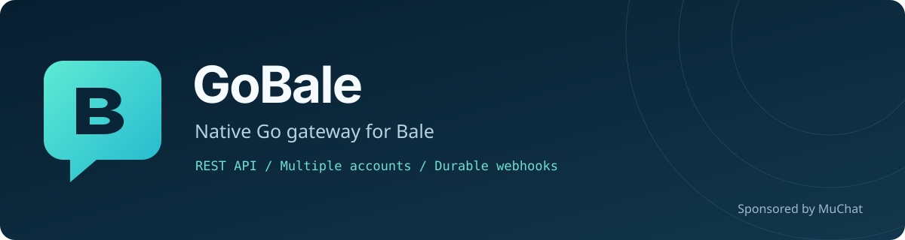

<p align="center">
  
</p>

[](https://github.com/mimalef70/gobale/actions/workflows/ci.yml)
[](https://github.com/mimalef70/gobale/releases)
[](LICENCE.txt)

**Connect Bale accounts to your application through REST and webhooks.**

GoBale is a self-hosted, multi-account gateway written in Go. Connect an account
with its phone number and login code, receive signed webhook events, and send
replies from your own inbox, support system or workflow.

Sponsored by **[MuChat](https://mu.chat)**. GoBale is independent open-source
software and works with any application; it has no dependency on MuChat.

[Releases](https://github.com/mimalef70/gobale/releases) ·
[Container images](https://github.com/users/mimalef70/packages/container/package/gobale) ·
[API reference](https://mimalef70.github.io/gobale/) ·
[OpenAPI](docs/openapi.yaml) · [Webhooks](docs/webhook-payload.md) ·
[Operations](docs/operations.md)

## Features

- Multiple accounts with separate sessions, media, history and persistent queues.
- Phone/code login, encrypted session storage and reconnect after restart.
- Text, images, files, audio, video and native Ogg Opus voice notes.
- Contacts, contact avatars, conversations and paginated message history.
- Group administration, permissions, replies, edits, reactions, polls and stickers.
- Per-device webhooks with HMAC signatures, event filters, retry and explicit replay.
- Durable sends with idempotency keys and inspectable pending or unknown outcomes.
- One-time and recurring message schedules that survive restarts.
- Authenticated REST, a CLI, health/readiness probes and Prometheus metrics.
- One binary or container, SQLite storage, and no dashboard, browser, Node.js or Redis runtime.

## Release status

GoBale is **alpha** and uses Bale's user-account protocol. It is not an official
Bale API or SDK; provider protocol changes can require an update. Core messaging,
media, native voice, contact avatars and selected group operations have been
checked with **two authorized accounts**. Advanced capabilities have differing
levels of verification; the API table lists routes, not successful live tests.

Ordinary-user keyboard-template sends were rejected in live testing. There is
no automatic transcoding, financial-transfer API or active-active deployment.
No claim of 50 real accounts or completed 24-hour production validation is made.
Use a test account and recipients you control before deploying an integration.

## Requirements

- **Binary:** a supported Linux or macOS system; release archives cover amd64 and arm64.
- **Container:** Docker, with Compose v2 for the checked-in deployment file.
- **Source build:** Go 1.26+ and a C compiler, or the `purego` build without a C compiler.
- Persistent disk for SQLite/media, a stable encryption key, and network access to Bale.
- Access to the account owner's phone/code and any two-step password during login.

Run exactly one GoBale process per database and media directory. Administrative
credentials can access every device; your application must enforce its own
operator and organization permissions. Use TLS for remote API access.

## Configuration

Precedence is **CLI flags → environment variables → `.env` in the working
directory → defaults**. `gobale init` generates `.env` and `master.key` with private
permissions and refuses to overwrite existing files. Keep credentials out of
command-line arguments, logs and public issues.

| Variable | Flag | Default | Purpose / bounds |
| --- | --- | --- | --- |
| `APP_HOST` | `--host` | `127.0.0.1` | Native listener address |
| `APP_PORT` | `--port` | `3000` | Port, 1–65535 |
| `APP_BASE_PATH` | `--base-path` | empty | Prefix every route, including health and metrics |
| `APP_BASIC_AUTH` | `--basic-auth` | required | One administrative `username:password` |
| `APP_DATABASE` | `--database` | `storages/gobale.db` | SQLite path |
| `APP_MEDIA_ROOT` | `--media-root` | `storages/media` | Private media directory |
| `APP_MASTER_KEY_FILE` | `--master-key-file` | empty | File with a base64 32-byte encryption key |
| `APP_MASTER_KEY` | `--master-key` | required without key file | Base64 32-byte encryption key |
| `BALE_APP_ID` | `--bale-app-id` | `0` | Verified client application ID |
| `BALE_API_KEY` | `--bale-api-key` | empty | Matching client application key |
| `BALE_API_VERSION` | `--bale-api-version` | `173855` | Reviewed web-client API version |
| `BALE_GRPC_ENDPOINT` | `--grpc-endpoint` | `https://next-ws.bale.ai` | gRPC-Web endpoint |
| `BALE_WS_ENDPOINT` | `--ws-endpoint` | `wss://next-ws.bale.ai/ws/` | WebSocket endpoint |
| `BALE_WEBHOOK` | `--webhook` | empty | Comma-separated global fallback URLs |
| `BALE_WEBHOOK_SECRET` | `--webhook-secret` | empty | Required HMAC secret when global URLs are set |
| `BALE_WEBHOOK_DEVICE_MERGE_GLOBAL` | `--webhook-device-merge-global` | `false` | Deliver to globals alongside a device override |
| `APP_SEND_WORKERS` | `--send-workers` | `4` | 1–64 globally; one active send per connection |
| `APP_WEBHOOK_WORKERS` | `--webhook-workers` | `8` | 1–64 delivery workers |
| `APP_RECONNECT_WORKERS` | `--reconnect-workers` | `4` | 1–4 concurrent reconnects |
| `APP_MEDIA_WORKERS` | `--media-workers` | `4` | 1–64 shared media transfer slots |
| `APP_QUEUE_LIMIT` | `--queue-limit` | `1000` | 1–100000 queued, sending and unknown operations |
| `APP_MAX_MEDIA_BYTES` | `--max-media-bytes` | `67108864` | Per-file bytes, 1–1073741824 |

`init` sets `APP_MASTER_KEY_FILE=master.key`. The file takes precedence when both
key settings exist, and must have private permissions (`chmod 600`). Keep this
key separately backed up: a newly generated key cannot recover existing sessions.
Sessions and stored secrets are encrypted; message bodies and ordinary media are
not application-encrypted. Protect the data directory and backups accordingly.

`--bale-web-client` explicitly opts in to the public application identity shipped
by the reviewed Bale web client. It does not copy a browser session or authenticate
an account. Omit the flag to configure another verified identity locally. Changing
API-version or endpoint values does not establish protocol compatibility.

`HTTP_PROXY`, `HTTPS_PROXY` and `NO_PROXY` apply to provider/webhook transports.
Media fetched from a caller-supplied URL uses direct, destination-checked requests.
Worker values are configurable bounds, not measured Bale account capacity.

## How to use

### Native binary

Download an archive from [Releases](https://github.com/mimalef70/gobale/releases),
verify its published checksum, unpack it and put `gobale` on your `PATH`. Run from
a directory where configuration and storage should live:

```sh
mkdir gobale-data
cd gobale-data
gobale init --bale-web-client
gobale rest
```

The default address is `http://127.0.0.1:3000`. Keep this process running. From a
second terminal in the same directory, connect an account:

```sh
gobale login --device support
```

The helper creates the device if needed, then prompts for the phone, login code
and optional two-step password. Codes/passwords are not echoed. Password whitespace
is preserved exactly; only the login code is trimmed. It requires an
interactive terminal and a loopback listener. Encrypted sessions survive normal
restarts; provider revocation can require login again.

### Build from source

```sh
git clone https://github.com/mimalef70/gobale.git
cd gobale/src
go build -trimpath -o ../bin/gobale .
cd ..
./bin/gobale init --bale-web-client
./bin/gobale rest
```

Use `./bin/gobale` wherever these examples say `gobale`. Without a C compiler,
replace the build command with `CGO_ENABLED=0 go build -tags purego -trimpath -o ../bin/gobale .`.

### Docker Compose

This setup needs Docker alone, not a host Go installation. In a POSIX shell on
Linux or macOS, clone the repository and initialize private configuration:

```sh
git clone https://github.com/mimalef70/gobale.git
cd gobale
export GOBALE_IMAGE='ghcr.io/mimalef70/gobale:v0.2.0-alpha.1'

docker run --rm --user "$(id -u):$(id -g)" \
  --volume "$PWD:/config" --workdir /config \
  "$GOBALE_IMAGE" init --bale-web-client

export APP_MASTER_KEY="$(cat master.key)"
docker compose up -d --no-build
docker compose exec gobale /app/gobale login --device support
```

The initializer writes files as your host user. Skip it if this directory is
already initialized. Use `up -d --build` to build the checked-out source instead.
`GOBALE_IMAGE` selects the image and is a Compose setting, not an API option.

Compose publishes only localhost. `APP_PORT` selects the host port; inside the
container GoBale listens on `0.0.0.0:3000`. SQLite/media live in a persistent named
volume under `/app/storages`; host `storages/` sessions are not imported. Host
`APP_DATABASE`, `APP_MEDIA_ROOT` and `APP_MASTER_KEY_FILE` are not forwarded.
The container gets `APP_MASTER_KEY` and its own storage paths. Environment changes
require container recreation, not just restart.

### Docker without Compose

After creating `.env` and `master.key` with the initializer above, the equivalent
standalone deployment can run instead of Compose:

```sh
export APP_MASTER_KEY="$(cat master.key)"
docker volume create gobale-data
docker run --detach --name gobale --restart unless-stopped \
  --publish 127.0.0.1:3000:3000 --env-file .env \
  --env APP_HOST=0.0.0.0 --env APP_PORT=3000 \
  --env APP_MASTER_KEY --env APP_MASTER_KEY_FILE= \
  --env APP_DATABASE=/app/storages/gobale.db \
  --env APP_MEDIA_ROOT=/app/storages/media \
  --volume gobale-data:/app/storages \
  --read-only --tmpfs /tmp:size=67108864,mode=1777 \
  --security-opt no-new-privileges:true --cap-drop ALL \
  --add-host host.docker.internal:host-gateway \
  ghcr.io/mimalef70/gobale:v0.2.0-alpha.1

docker exec -it gobale /app/gobale login --device support
```

Do not run native, standalone Docker and Compose services against the same data
or published port. Container `127.0.0.1` is the container itself; use an appropriate
service name or `host.docker.internal` to reach a receiver on the host.

## Connect your application

Load the generated local settings for the following `curl` examples. Include
`APP_BASE_PATH` in the URL if configured; source builds use `./bin/gobale`.

```sh
set -a
. ./.env
set +a
GOBALE_URL='http://127.0.0.1:3000'
GOBALE_DEVICE='support'
gobale_api() {
  curl --silent --show-error --fail-with-body --user "$APP_BASIC_AUTH" \
    -H "X-Device-Id: $GOBALE_DEVICE" "$@"
}

curl --fail-with-body "$GOBALE_URL/health"
gobale_api "$GOBALE_URL/ready"
gobale_api "$GOBALE_URL/devices/support/status"
```

Only `/health` is public. Readiness checks storage, not every account. Inspect
both transport and recovery: a connected socket alone does not mean the inbox is
fully recovered. Initial connection establishes a current baseline; it does not
automatically import the entire old inbox.

Select devices with `X-Device-Id`, or `device_id` query when the header is absent.
Implicit selection works only with one registered device. An explicit invalid
selector never falls back. Data belongs to an immutable connection: reusing a
deleted alias does not inherit its old jobs, history or media. Every request stays
bound to its originally selected connection, including while its body is read;
deleting that connection never redirects the request to a replacement account.

For application-managed login, use `POST /devices`, then `/devices/{device_id}/login`
with `phone`, `/devices/{device_id}/login/code` with `challenge_id` and `code`, and
`/devices/{device_id}/login/password` with the challenge and password if requested.
Keep codes in request bodies. A
device already bound to one account cannot be used for a different account.

### Messages and history

Use account-visible identifiers from contacts or conversations. Provider IDs are
JSON **strings**; message IDs may be signed int64 values, so preserve their sign.

```sh
gobale_api "$GOBALE_URL/user/my/contacts"
gobale_api "$GOBALE_URL/chats?source=remote&limit=20"
gobale_api "$GOBALE_URL/chat/user:REPLACE_WITH_USER_ID/history?limit=20"

gobale_api -H 'Content-Type: application/json' \
  -H 'Idempotency-Key: support-message-0001' \
  --data '{"peer":{"type":"user","id":"REPLACE_WITH_USER_ID"},"message":"Hello from our support team"}' \
  "$GOBALE_URL/send/message"

gobale_api "$GOBALE_URL/send/operations/REPLACE_WITH_SEND_ID"
```

Save a key once per logical send and reuse it with the identical payload when
retrying; changed content under the same key returns `409`. A `200` confirms
provider acceptance, not delivery/read. After about 40 seconds a pending request
can return `202` with `results.send_id`. Inspect the operation with the same
device. Never create another send/key merely because its state is `unknown`.

Remote history uses millisecond date cursors, not offsets. Preserve original
message dates with their IDs for reads and forwards. Local `/messages` returns
stored events, including edits/deletions, rather than a projected transcript.
For forward/backward history, continue with `results.next_date` and deduplicate
message IDs at timestamp boundaries. If a full page cannot advance the cursor,
it omits `next_date` and reports `incomplete: true` with
`pagination_stop_reason: "non_advancing_cursor"`. Keep that page and stop automatic
pagination; adjusting its date yourself could skip messages. Exhaustive history
export remains unproven. Around mode returns bounds, not a continuation cursor.
Phone lookup can fail due to discoverability; it never silently imports contacts.

### Media, voice and avatars

Upload a raw body to the selected device; use the returned `results.id` to send:

```sh
gobale_api -H 'Content-Type: audio/ogg' -H 'X-Filename: reply.ogg' \
  --data-binary @reply.ogg "$GOBALE_URL/media"
gobale_api -H 'Content-Type: application/json' \
  -H 'Idempotency-Key: support-voice-0001' \
  --data '{"peer":{"type":"user","id":"REPLACE_WITH_USER_ID"},"media_id":"REPLACE_WITH_MEDIA_ID"}' \
  "$GOBALE_URL/send/voice"

gobale_api --output received-file \
  "$GOBALE_URL/message/REPLACE_WITH_MESSAGE_ID/download?peer=user:REPLACE_WITH_USER_ID"
gobale_api --output avatar-image \
  "$GOBALE_URL/user/avatar?peer=user:REPLACE_WITH_USER_ID&size=small"
```

`/send/audio` sends audio/music; `/send/voice` sends a native voice note. Native
voice requires a complete mono/stereo Ogg Opus stream, with duration derived from
the bytes in milliseconds. MP3, WAV and WebM need conversion before upload.
Uploading stores a file; format validation and provider acceptance happen during
send. There is no automatic transcoding or waveform generation.

Avatars return JPEG/PNG/GIF bytes on success, and JSON errors otherwise. Check the
HTTP result and content type before display. `small` is the default; `large` can
fall back to another available rendition. `AVATAR_NOT_FOUND` covers absent/private
photos. Downloads are capped at 8 MiB, the configured media limit, 8192 pixels per
side and 16,777,216 total pixels; GIF validation covers its first frame. Provider
file hashes and signed URLs stay internal. Media IDs never cross device scope.

### Scheduled messages

```sh
gobale_api -H 'Content-Type: application/json' \
  -H 'Idempotency-Key: demo-001' \
  --data '{"peer":{"type":"user","id":"REPLACE_WITH_USER_ID"},"kind":"text","message":"Scheduled follow-up","scheduled_at":"2030-01-15T08:00:00+03:30","timezone":"Asia/Tehran","recurrence":"daily","occurrence_limit":3}' \
  "$GOBALE_URL/send/schedules"
```

Use a future RFC3339 timestamp and IANA timezone. Recurrence supports `none`,
`daily`, `weekly` and `monthly`; `once` is also accepted as an alias for `none`.
Omitted or empty recurrence means one occurrence. Surrounding timestamp whitespace
is ignored for execution, including already-stored schedules; original request
values remain unchanged for idempotency. Pause/resume/cancel by the schedule `id`.
Media schedules use the appropriate `kind` and local `media_id`. A schedule
occurrence and its outbox entry commit together. Cancelling a schedule stops
future occurrences, not work already accepted by Bale.

### Webhooks

```sh
gobale_api -X PATCH -H 'Content-Type: application/json' \
  --data '{"webhook_url":"https://your-app.example/bale/events","webhook_secret":"REPLACE_WITH_A_RANDOM_SECRET","webhook_events":["message","message.edited","message.deleted"]}' \
  "$GOBALE_URL/devices/support/webhook"
gobale_api "$GOBALE_URL/deliveries?limit=20"
```

Verify `X-Hub-Signature-256` over the exact raw request body and durably deduplicate
`event_id` before acknowledging. Delivery is **at least once**. In an event,
`session_id` is the local device alias and `device_id` is the Bale account ID.

A device webhook overrides global `BALE_WEBHOOK`; an empty URL restores fallback.
`BALE_WEBHOOK_DEVICE_MERGE_GLOBAL=true` includes both. Empty event filters accept
all events; secrets are write-only. URL changes pause pending old deliveries;
explicit replay chooses current destinations. See [Webhook payloads](docs/webhook-payload.md)
for event examples, signatures and retry handling.

## Mini App signing helpers

The standalone Go package `src/pkg/miniapp` accepts at most 63 fields for `Sign`;
the generated `hash` brings the verified query limit to 64 fields. Both paths
reject Unicode control characters, duplicate or ambiguous names and malformed
encoding, while preserving legitimate field whitespace and Unicode. Always use
`Verify` with expiry checks; locally signing data does not prove provider login.

## Current API

The complete request/response contract is [docs/openapi.yaml](docs/openapi.yaml).
Use the [read-only API explorer](https://mimalef70.github.io/gobale/) to browse
schemas; do not enter deployment credentials into a public documentation site.
The table below covers all **175 registered method/path combinations**, grouped
by their OpenAPI tags. It is an endpoint inventory, not a live-verification score.
Typed provider mutations require `Idempotency-Key`; provider permissions still
apply. Unsupported operations return an explicit error rather than simulated success.

| Group | Operation | Method | URL |
| --- | --- | --- | --- |
| Service | List typed operation contracts | `GET` | `/app/capabilities` |
| Service | Get service version and capabilities | `GET` | `/app/info` |
| Service | Check service liveness | `GET` | `/health` |
| Service | Get Prometheus metrics | `GET` | `/metrics` |
| Service | Run a typed operation | `POST` | `/operations/{operation}` |
| Service | Check storage readiness | `GET` | `/ready` |
| Devices and login | List devices | `GET` | `/app/devices` |
| Devices and login | Get account connection status | `GET` | `/app/status` |
| Devices and login | List devices | `GET` | `/devices` |
| Devices and login | Create a device | `POST` | `/devices` |
| Devices and login | Delete a device | `DELETE` | `/devices/{device_id}` |
| Devices and login | Get a device | `GET` | `/devices/{device_id}` |
| Devices and login | Start phone login | `POST` | `/devices/{device_id}/login` |
| Devices and login | Submit a login code | `POST` | `/devices/{device_id}/login/code` |
| Devices and login | Submit a two-step password | `POST` | `/devices/{device_id}/login/password` |
| Devices and login | Log out a device | `POST` | `/devices/{device_id}/logout` |
| Devices and login | Reconnect a device | `POST` | `/devices/{device_id}/reconnect` |
| Devices and login | Get device connection status | `GET` | `/devices/{device_id}/status` |
| Account | Change the account bio | `POST` | `/user/about` |
| Account | Change the account avatar | `POST` | `/user/avatar` |
| Account | Block a user | `POST` | `/user/block` |
| Account | List blocked users | `GET` | `/user/blocked` |
| Account | Get the connected account profile | `GET` | `/user/info` |
| Account | Change the account display name | `POST` | `/user/name` |
| Account | Get privacy rules | `GET` | `/user/privacy` |
| Account | Update a privacy rule | `POST` | `/user/privacy` |
| Account | Get privacy status | `GET` | `/user/privacy/status` |
| Account | Change the account display name | `POST` | `/user/pushname` |
| Account | List account sessions | `GET` | `/user/sessions` |
| Account | Terminate an account session | `POST` | `/user/sessions/terminate` |
| Account | Terminate other account sessions | `POST` | `/user/sessions/terminate-others` |
| Account | Get account settings | `GET` | `/user/settings` |
| Account | Update an account setting | `POST` | `/user/settings` |
| Account | Unblock a user | `POST` | `/user/unblock` |
| Account | Change the account username | `POST` | `/user/username` |
| Account | Check username availability | `GET` | `/user/username/check` |
| Contacts | Download a contact avatar | `GET` | `/user/avatar` |
| Contacts | Resolve a phone number to a user | `GET` | `/user/check` |
| Contacts | Add a contact | `POST` | `/user/contacts/add` |
| Contacts | Import phone contacts | `POST` | `/user/contacts/import` |
| Contacts | Remove a contact | `POST` | `/user/contacts/remove` |
| Contacts | Rename a contact | `POST` | `/user/contacts/rename` |
| Contacts | Reset imported contacts | `POST` | `/user/contacts/reset` |
| Contacts | List contacts | `GET` | `/user/my/contacts` |
| Contacts | Get user profiles | `GET` | `/user/profiles` |
| Contacts | Search contacts | `GET` | `/user/search` |
| Conversations | Clear conversation history | `POST` | `/chat/clear` |
| Conversations | Delete a conversation | `POST` | `/chat/delete` |
| Conversations | Load conversation history from Bale | `GET` | `/chat/{chat_jid}/history` |
| Conversations | List stored conversation events | `GET` | `/chat/{chat_jid}/messages` |
| Conversations | List conversations | `GET` | `/chats` |
| Send messages | Send an audio file | `POST` | `/send/audio` |
| Send messages | Send a contact card | `POST` | `/send/contact` |
| Send messages | Send a file | `POST` | `/send/file` |
| Send messages | Send an image | `POST` | `/send/image` |
| Send messages | Send a location | `POST` | `/send/location` |
| Send messages | Send a text message | `POST` | `/send/message` |
| Send messages | Create and send a poll | `POST` | `/send/poll` |
| Send messages | Send a sticker | `POST` | `/send/sticker` |
| Send messages | Send a keyboard template (experimental) | `POST` | `/send/template` |
| Send messages | Send a video | `POST` | `/send/video` |
| Send messages | Send a native voice note | `POST` | `/send/voice` |
| Send operations | Get a send operation | `GET` | `/send/operations/{send_id}` |
| Media | Upload media to a device | `POST` | `/media` |
| Media | Fetch media from a public URL | `POST` | `/media/fetch` |
| Media | Download a local media file | `GET` | `/media/{media_id}` |
| Media | Download a message attachment | `GET` | `/message/{message_id}/download` |
| Schedules | List message schedules | `GET` | `/send/schedules` |
| Schedules | Create a message schedule | `POST` | `/send/schedules` |
| Schedules | Get a message schedule | `GET` | `/send/schedules/{schedule_id}` |
| Schedules | Cancel a message schedule | `POST` | `/send/schedules/{schedule_id}/cancel` |
| Schedules | Pause a message schedule | `POST` | `/send/schedules/{schedule_id}/pause` |
| Schedules | Resume a message schedule | `POST` | `/send/schedules/{schedule_id}/resume` |
| Webhooks | List webhook deliveries | `GET` | `/deliveries` |
| Webhooks | Get a webhook delivery | `GET` | `/deliveries/{delivery_id}` |
| Webhooks | Replay an event to current destinations | `POST` | `/deliveries/{delivery_id}/replay` |
| Webhooks | Retry a failed webhook delivery | `POST` | `/deliveries/{delivery_id}/retry` |
| Webhooks | Get device webhook settings | `GET` | `/devices/{device_id}/webhook` |
| Webhooks | Update device webhook settings | `PATCH` | `/devices/{device_id}/webhook` |
| Message actions | Pin a message | `POST` | `/message/pin` |
| Message actions | List pinned messages | `GET` | `/message/pins` |
| Message actions | Remove a message reaction | `POST` | `/message/reaction/remove` |
| Message actions | Set a message reaction | `POST` | `/message/reaction/set` |
| Message actions | List users for a reaction | `GET` | `/message/reaction/users` |
| Message actions | Get message reactions | `GET` | `/message/reactions` |
| Message actions | Acknowledge received messages | `POST` | `/message/received` |
| Message actions | Unpin a message | `POST` | `/message/unpin` |
| Message actions | Unpin all conversation messages | `POST` | `/message/unpin-all` |
| Message actions | Upvote a message | `POST` | `/message/upvote` |
| Message actions | Remove a message upvote | `POST` | `/message/upvote/remove` |
| Message actions | List message upvoters | `GET` | `/message/upvoters` |
| Message actions | Get message view counts | `GET` | `/message/views` |
| Message actions | Increment message view counts | `POST` | `/message/views/increment` |
| Message actions | Delete a message | `POST` | `/message/{message_id}/delete` |
| Message actions | Forward a message | `POST` | `/message/{message_id}/forward` |
| Message actions | Set a message reaction | `POST` | `/message/{message_id}/reaction` |
| Message actions | Mark messages read through a timestamp | `POST` | `/message/{message_id}/read` |
| Message actions | Revoke a message (not supported) | `POST` | `/message/{message_id}/revoke` |
| Message actions | Edit a text message | `POST` | `/message/{message_id}/update` |
| Groups | Create a group | `POST` | `/group` |
| Groups | List group administrators | `GET` | `/group/admins` |
| Groups | List banned group members | `GET` | `/group/banned` |
| Groups | Get default group permissions | `GET` | `/group/default-permissions` |
| Groups | Update default group permissions | `POST` | `/group/default-permissions` |
| Groups | Change history visibility for new members | `POST` | `/group/history-visibility` |
| Groups | Get group details | `GET` | `/group/info` |
| Groups | Get a group invite link | `GET` | `/group/invite-link` |
| Groups | Revoke a group invite link | `POST` | `/group/invite-link/revoke` |
| Groups | Join a public group | `POST` | `/group/join-public` |
| Groups | Join a group by invitation | `POST` | `/group/join-with-link` |
| Groups | Leave a group | `POST` | `/group/leave` |
| Groups | Change group member visibility | `POST` | `/group/member-visibility` |
| Groups | Change a group name | `POST` | `/group/name` |
| Groups | Transfer group ownership | `POST` | `/group/owner` |
| Groups | List group members | `GET` | `/group/participants` |
| Groups | Invite users to a group | `POST` | `/group/participants` |
| Groups | Demote a group administrator | `POST` | `/group/participants/demote` |
| Groups | Promote a group member | `POST` | `/group/participants/promote` |
| Groups | Remove a group member | `POST` | `/group/participants/remove` |
| Groups | Unban a group member | `POST` | `/group/participants/unban` |
| Groups | Get member permissions | `GET` | `/group/permissions` |
| Groups | Update member permissions | `POST` | `/group/permissions` |
| Groups | Change a group photo | `POST` | `/group/photo` |
| Groups | Remove a group photo | `POST` | `/group/photo/remove` |
| Groups | Pin a group message | `POST` | `/group/pin` |
| Groups | List pinned group messages | `GET` | `/group/pins` |
| Groups | Preview a group invitation | `GET` | `/group/preview` |
| Groups | Update group restrictions | `POST` | `/group/restriction` |
| Groups | Change a group description | `POST` | `/group/topic` |
| Groups | Unpin a group message | `POST` | `/group/unpin` |
| Groups | Unpin all group messages | `POST` | `/group/unpin-all` |
| Groups | Change a group username | `POST` | `/group/username` |
| Groups | List joined groups | `GET` | `/user/my/groups` |
| Channels | Create a channel | `POST` | `/channel` |
| Channels | List channels | `GET` | `/channels` |
| Presence | Get contact presence | `GET` | `/presence/contacts` |
| Presence | Get group presence | `GET` | `/presence/group` |
| Presence | Get the group online count | `GET` | `/presence/group/count` |
| Presence | Set account online presence | `POST` | `/presence/online` |
| Presence | Stop a typing or activity signal | `POST` | `/presence/stop` |
| Presence | Send a typing or activity signal | `POST` | `/presence/typing` |
| Presence | Get user presence | `GET` | `/presence/users` |
| Presence | Send a typing or activity signal | `POST` | `/send/chat-presence` |
| Presence | Set account online presence | `POST` | `/send/presence` |
| Folders | List conversation folders | `GET` | `/folders` |
| Folders | Create a conversation folder | `POST` | `/folders` |
| Folders | Delete a conversation folder | `POST` | `/folders/delete` |
| Folders | Update a conversation folder | `POST` | `/folders/edit` |
| Polls | Close a poll | `POST` | `/poll/close` |
| Polls | Get detailed poll results | `GET` | `/poll/full-results` |
| Polls | Get poll results | `GET` | `/poll/results` |
| Polls | Submit or retract a poll vote | `POST` | `/poll/vote` |
| Stickers | Get a sticker collection | `GET` | `/sticker/collection` |
| Stickers | Add a sticker collection | `POST` | `/sticker/collection/add` |
| Stickers | Remove a sticker collection | `POST` | `/sticker/collection/remove` |
| Stickers | List sticker collections | `GET` | `/sticker/collections` |
| Stories | Get a story | `GET` | `/story` |
| Stories | Publish a text or image story | `POST` | `/story/add` |
| Stories | Delete a story | `POST` | `/story/delete` |
| Stories | List the available story feed | `GET` | `/story/list` |
| Stories | React to a story | `POST` | `/story/react` |
| Stories | List story viewers | `GET` | `/story/viewers` |
| Reports | Dismiss a report prompt | `POST` | `/report/dismiss` |
| Reports | Report messages | `POST` | `/report/messages` |
| Reports | Report a user or group | `POST` | `/report/peer` |
| Reports | Report stories | `POST` | `/report/story` |
| Mini Apps | Invoke a Mini App method | `POST` | `/miniapp/custom` |
| Mini Apps | Send Mini App data | `POST` | `/miniapp/data` |
| Mini Apps | Get Mini App authentication data | `GET` | `/miniapp/hash` |
| Mini Apps | Get a Mini App menu | `GET` | `/miniapp/menu` |
| Mini Apps | Get a signed Mini App launch URL | `GET` | `/miniapp/url` |
| Bot callbacks | Send a bot button callback | `POST` | `/bot/callback` |
| Link previews | Get a link preview | `GET` | `/link/summary` |
| Wallet information | Get legacy wallet balance information | `GET` | `/wallet/kifpools` |
| Wallet information | List wallet balances | `GET` | `/wallet/list` |

## Operations and development

Run a single process per data directory. Stop it cleanly before a cold backup,
copy the database and required media, and preserve the encryption key separately.
Do not run an original and restored copy against the same account simultaneously.
There is no automatic history/media TTL; deleting a device does not erase its
audit history. Monitor disk space, recovery gaps, unknown sends and failed deliveries.
See [Operations](docs/operations.md) for deployment, backup/restore and retention.

Normal tests use fake providers and temporary databases; they do not contact Bale.
Run checks from the Go module directory:

```sh
cd src
go test ./...
go test -race ./...
go test -tags purego ./...
go vet ./...
```

Development architecture, invariants, protocol evidence and acceptance work are
maintained in [AGENTS.md](https://github.com/mimalef70/gobale/blob/main/AGENTS.md).
GoBale is distributed under the [MIT license](LICENCE.txt).
Keep account credentials, OTPs, sessions, databases and private message
content out of public issues and commits.
