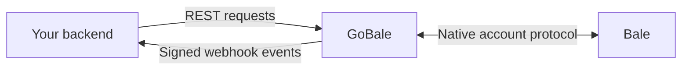

<p align="center">
  
</p>

[](https://github.com/mimalef70/gobale/actions/workflows/ci.yml)
[](https://github.com/mimalef70/gobale/releases)
[](LICENCE.txt)

**Connect your Bale accounts to any application through REST APIs and signed webhooks.**

GoBale is a self-hosted gateway written in Go. Run one service, connect independent
Bale accounts with phone/code login, and use your own application to send messages
and receive events. Sessions, message history, media and delivery queues stay on
your server. The administrative panel is included in the binary.

Sponsored by **[MuChat](https://mu.chat)**. GoBale is independent open-source
software, available to everyone under the MIT license.

[Download binaries](https://github.com/mimalef70/gobale/releases) ·
[GHCR](https://github.com/users/mimalef70/packages/container/package/gobale) ·
[Docker Hub](https://hub.docker.com/r/mimalef70/gobale) ·
[API reference](https://mimalef70.github.io/gobale/) ·
[OpenAPI](docs/openapi.yaml)

## Contents

- [Features](#features)
- [Release status](#release-status)
- [How to use](#how-to-use)
- [Configuration](#configuration)
- [Connect your application](#connect-your-application)
- [Important behavior](#important-behavior)
- [Documentation and support](#documentation-and-support)
- [Development](#development)

## Features

- **Multiple accounts:** separate login sessions, peers, files and durable work for each connection.
- **Messaging:** text, images, files, audio, video and native Ogg Opus voice notes; replies, edits, forwards and reactions.
- **Scheduling:** one-time or daily, weekly and monthly sends, with pause/resume/cancel and per-execution results.
- **Signed webhooks:** per-account destinations, event/peer/sender filters, delivery history, retries and explicit replay.
- **Local queries:** search stored message events and inspect pending, completed or uncertain sends.
- **Account tools:** contacts, avatars, conversations, groups, polls and other documented provider operations.
- **Administrative panel:** English/Persian, account login, connection/recovery status and webhook management.
- **Operations:** encrypted sessions, restart recovery, bounded workers, health checks and Prometheus metrics.
- **Simple runtime:** one Go binary and SQLite; no browser, Node.js, Redis or PostgreSQL runtime dependency.

Your backend owns users, permissions and conversations. GoBale manages the Bale
connections and delivery work. A user in your application can own several
connections; save that ownership mapping in your application's database.



The panel is for gateway administrators. It manages accounts and webhooks; it is
not a customer login page or a chat inbox.

## Release status

**The installation commands and API examples below target GoBale 2.0.0.**
The online API reference follows `main` and can advance beyond a release; use the
documentation and OpenAPI shipped with your installed version. Historical 1.x
behavior remains documented in the
[v1.0.0 README](https://github.com/mimalef70/gobale/blob/v1.0.0/readme.md).

**2.0 is a breaking API upgrade.** Account-scoped requests require explicit
selection and `X-Device-Instance`; device creation, sends and schedule creation
require `Idempotency-Key`. The release also adds local search, webhook filters,
occurrence tracking and per-connection queue limits, and migrates storage to
schema 7. Update consumers with the gateway, and follow the
[upgrade procedure](docs/operations.md#backup-restore-and-upgrades) before
replacing an existing deployment. See the [2.0.0 changes](CHANGELOG.md#200--2026-10-07).

GoBale uses Bale's user-account protocol and is **not an official Bale API or SDK**.
Core login, messaging, media, voice and selected group operations have been tested
with two authorized accounts. Verification varies by operation; see the
[capability inventory](src/internal/balemeow/testdata/coverage/capabilities.json).
Mentions and scheduled forwarding have offline coverage but still need live
provider validation. Ordinary-user keyboard-template sends failed in live tests.
A 300-client simulation is not proof of 300 real accounts or 24-hour stability.

## How to use

Choose one installation method. You need access to the account owner's phone/code
and any two-step password. The default listener is `http://127.0.0.1:3000`.

### Docker Compose

Requires Docker with Compose v2 and Git. No host Go or Node installation is needed.
Check out the matching release configuration and pull the v2.0.0 image:

```sh
git clone --branch v2.0.0 --depth 1 https://github.com/mimalef70/gobale.git
cd gobale
export GOBALE_IMAGE='ghcr.io/mimalef70/gobale:v2.0.0'
docker pull "$GOBALE_IMAGE"

docker run --rm --user "$(id -u):$(id -g)" \
  --volume "$PWD:/config" --workdir /config \
  "$GOBALE_IMAGE" init --bale-web-client

export APP_MASTER_KEY="$(cat master.key)"
docker compose up -d --no-build
```

Run these commands in a POSIX shell on Linux or macOS. `init` creates a private
`.env` and `master.key` and refuses to overwrite them; skip initialization when
reusing an existing installation. Keep the key safe: replacing it cannot recover
old encrypted sessions.

Open **http://127.0.0.1:3000/ui/** and sign in with the generated `APP_BASIC_AUTH`
username/password from your local `.env`. Add a connection such as `support`,
then enter the Bale phone number, code and password if requested. Adding another
connection follows the same steps.

```sh
docker compose ps
docker compose logs --tail=100 gobale
```

Compose stores SQLite and media in a named volume at `/app/storages` and publishes
only on localhost. It does not import a host `storages/` directory. Keep the volume
when recreating the container; `docker compose down -v` deletes it. Read
[Operations](docs/operations.md) before changing images or exposing the service.

Both `ghcr.io/mimalef70/gobale:v2.0.0` and `mimalef70/gobale:v2.0.0` select this
release. To use Docker Hub, set `GOBALE_IMAGE='mimalef70/gobale:v2.0.0'` before
pulling and starting it. `GOBALE_IMAGE` is a Compose setting. Release tags are
fixed; a source push does not republish them. For standalone Docker, see
[Docker without Compose](docs/operations.md#docker-without-compose).

### Native binary

Download the v2.0.0 archive for your operating system and architecture from
[Releases](https://github.com/mimalef70/gobale/releases/tag/v2.0.0), verify its checksum,
and put `gobale` on your `PATH`. Linux and macOS archives cover amd64 and arm64.
Use the documentation included in that archive for its API contract.

```sh
mkdir gobale-data
cd gobale-data
gobale init --bale-web-client
gobale rest
```

Keep the service running and open **http://127.0.0.1:3000/ui/**. If you prefer an
interactive terminal, run this from a second terminal in the same directory:

```sh
gobale login --device support
```

The login helper creates or selects the connection and prompts for the phone,
code and any password. It connects to the running loopback REST service; it does
not start a second database owner. Sessions normally survive service restarts;
provider revocation can require a new login.

### Build from source

Requires Go **1.26.6**, Node **24.12+**, Python **3.11+**, Make and a C compiler:

```sh
git clone --branch v2.0.0 --depth 1 https://github.com/mimalef70/gobale.git
cd gobale
make build
./bin/gobale init --bale-web-client
./bin/gobale rest
```

Use `./bin/gobale` in place of `gobale` in the native instructions. The tag keeps
the source, documentation and artifact version aligned; use `main` separately
for development. Node builds the embedded panel; it is not needed to run the result. Without a C compiler, run
`make ui-build` followed by:

```sh
(cd src && CGO_ENABLED=0 go build -tags purego -trimpath -o ../bin/gobale .)
```

A manual Go build without matching UI assets refuses UI-enabled startup. For an
intentional API-only build, set `APP_UI_ENABLED=false`.

## Configuration

Settings load in this order: **CLI flags → environment variables → local `.env`
→ defaults**. Start with `gobale init --bale-web-client`, then edit the generated
configuration. The flag selects the reviewed public Bale web-client application
identity; it does not authenticate an account or reuse a browser session.

| Setting | Default | When to change it |
| --- | --- | --- |
| `APP_BASIC_AUTH` | Generated by `init` | Set your gateway administrator credential. It grants access to every connection. |
| `APP_PORT` | `3000` | Change the native listener or Compose host port. |
| `APP_BASE_PATH` | Empty | Serve all routes below a prefix such as `/bale`. |
| `APP_UI_ENABLED` | `true` | Disable the embedded administrative panel. |
| `APP_UI_PUBLIC_ORIGIN` | Empty | Set the exact HTTPS origin for remote panel access. |
| `APP_MAX_MEDIA_BYTES` | `67108864` (64 MiB) | Set the maximum size of an uploaded/downloaded file. |
| `APP_QUEUE_LIMIT` | `1000` | Bound queued, sending and unknown operations across the gateway. |
| `APP_CONNECTION_QUEUE_LIMIT` | `100` | Bound those operations within one connection. |
| `BALE_WEBHOOK` / `BALE_WEBHOOK_SECRET` | Empty | Configure global fallback webhook destinations and their signing secret. |

See the [full configuration reference](docs/operations.md#configuration-reference)
for flags, key files, provider endpoints, proxy behavior and worker limits.

Use exactly **one process per database and media directory**. SQLite uses WAL/FULL
durability; this deployment does not support active-active replicas. Sessions and
stored secrets are encrypted, while event bodies and ordinary media are not
application-encrypted. Protect the storage volume, `.env`, encryption key and backups.

For remote access, configure TLS and `APP_UI_PUBLIC_ORIGIN`; follow the
[panel deployment guide](docs/operations.md#administrative-panel). Do not expose
administrative credentials to your application's end-user browser. Container
configuration changes require recreation, not merely `docker restart`.

## Connect your application

These examples target **GoBale 2.0** and use `curl` plus `jq`. First connect
an account named `support` through the panel or CLI. Run the following in the
initialized directory; load only your own trusted `.env`:

```sh
set -a
. ./.env
set +a
GOBALE_URL="http://127.0.0.1:${APP_PORT:-3000}${APP_BASE_PATH:-}"
GOBALE_DEVICE='support'
GOBALE_INSTANCE=$(curl --silent --show-error --fail-with-body --user "$APP_BASIC_AUTH" \
  "$GOBALE_URL/devices" | jq -er --arg id "$GOBALE_DEVICE" \
  '.results[] | select(.id == $id) | .instance_id')

gobale_api() {
  curl --silent --show-error --fail-with-body --user "$APP_BASIC_AUTH" \
    -H "X-Device-Id: $GOBALE_DEVICE" \
    -H "X-Device-Instance: $GOBALE_INSTANCE" "$@"
}

gobale_api "$GOBALE_URL/devices/$GOBALE_DEVICE/status"
```

A connection alias such as `support` is your local name. Its `instance_id`
identifies that specific connection lifetime. Store both in your backend's
channel record; deleting and recreating the alias produces a different instance.
Fetch the instance during setup, not automatically after a stale-reference error.

Every account-scoped request must select the account and include its saved
`X-Device-Instance`. Path, header and query selectors must agree. A missing selector
or instance returns 400; an instance that has been replaced returns 409. This
prevents an old request from acting on a different account after alias reuse.

### Send a message and inspect its result

Find a recipient in the selected account's contacts or conversations:

```sh
gobale_api "$GOBALE_URL/user/my/contacts"
gobale_api "$GOBALE_URL/chats?source=remote&limit=20"

gobale_api -H 'Content-Type: application/json' \
  -H 'Idempotency-Key: support-message-0001' \
  --data '{"peer":{"type":"user","id":"REPLACE_WITH_USER_ID"},"message":"Hello from GoBale"}' \
  "$GOBALE_URL/send/message"

gobale_api "$GOBALE_URL/send/operations/REPLACE_WITH_SEND_ID"
gobale_api "$GOBALE_URL/send/operations?state=unknown&limit=20"
```

Keep all provider IDs as **strings**, including signed message/file IDs. The
response uses a `code`, `message`, `results` envelope. Save `results.send_id` to
inspect the durable operation later.

Choose one idempotency key per logical send, persist it before submitting, and
reuse it with exactly the same content if the response is lost. Changed content
under that key returns 409. Keys are scoped to the connection; immediate sends
and schedules share the same namespace.

| Outcome | Meaning and next step |
| --- | --- |
| `200`, `succeeded` | Bale accepted the operation. This is not a recipient delivery/read receipt. |
| `202`, `queued` or `sending` | Work is durably accepted and still pending. Poll the same operation. |
| `202`, `unknown` | The provider result is uncertain. Do not create a new key to resend it. |
| `429`, queue full | Admission was rejected. Slow down and retry the same logical request/key later. |
| Error with `results.send_id` | Preserve the operation ID and inspect its recorded failure. |

The synchronous send wait is up to 40 seconds. A request ending or timing out
after durable acceptance does not cancel the work.

### Upload and send media

Upload a file as a raw body, then use its returned `results.id`:

```sh
gobale_api -H 'Content-Type: image/jpeg' -H 'X-Filename: photo.jpg' \
  --data-binary @photo.jpg "$GOBALE_URL/media"

gobale_api -H 'Content-Type: application/json' \
  -H 'Idempotency-Key: support-photo-0001' \
  --data '{"peer":{"type":"user","id":"REPLACE_WITH_USER_ID"},"media_id":"REPLACE_WITH_MEDIA_ID","message":"A photo from GoBale"}' \
  "$GOBALE_URL/send/image"
```

Use `/send/file`, `/send/audio`, `/send/video` or `/send/voice` for the corresponding
media type. Use `message` for a media caption. **Voice notes require a complete
mono/stereo Ogg Opus stream**; duration
comes from the file, and GoBale does not transcode MP3, WAV or WebM. Uploaded media
belong to one connection and cannot be reused by another.

Download received attachments through the authenticated API when the event says
`download_supported: true`:

```sh
gobale_api --output received-file \
  "$GOBALE_URL/message/REPLACE_WITH_MESSAGE_ID/download?peer=user:REPLACE_WITH_USER_ID"
gobale_api --output avatar-image \
  "$GOBALE_URL/user/avatar?peer=user:REPLACE_WITH_USER_ID&size=small"
```

Check the HTTP result and content type before displaying downloaded bytes. Provider
file URLs and access hashes stay private; forward neither credentials nor cookies
to a URL found inside a message.

### Schedule a message

```sh
gobale_api -H 'Content-Type: application/json' \
  -H 'Idempotency-Key: support-schedule-0001' \
  --data '{"peer":{"type":"user","id":"REPLACE_WITH_USER_ID"},"kind":"text","message":"Scheduled follow-up","scheduled_at":"2030-01-15T08:00:00+03:30","timezone":"Asia/Tehran","recurrence":"daily","occurrence_limit":3}' \
  "$GOBALE_URL/send/schedules"

gobale_api "$GOBALE_URL/send/schedules?state=active&limit=20"
gobale_api "$GOBALE_URL/send/schedules/REPLACE_WITH_SCHEDULE_ID/occurrences"
```

Choose a future RFC3339 timestamp and an IANA timezone. Recurrence supports `none`,
`daily`, `weekly` and `monthly`; `once` is an alias for `none`. Each occurrence is
recorded together with its send operation. A `completed` schedule has no future
occurrences; read each occurrence's operation to learn its send outcome.
Pause/cancel stops future occurrences, not already-created send operations.

### Receive signed webhooks

```sh
gobale_api -X PATCH -H 'Content-Type: application/json' \
  --data '{"webhook_url":"https://your-app.example/bale/events","webhook_secret":"REPLACE_WITH_A_RANDOM_SECRET","webhook_events":["message","message.edited","message.deleted"]}' \
  "$GOBALE_URL/devices/$GOBALE_DEVICE/webhook"

gobale_api "$GOBALE_URL/deliveries?limit=20"
```

Verify `X-Hub-Signature-256` over the exact raw body. Match the signed connection
and account identity to your saved binding, commit the event to a durable inbox,
and deduplicate retries before returning 2xx. Delivery is **at least once**.

| Event field | Identifies |
| --- | --- |
| `event_id` | The event; stable across retry/replay. |
| `session_id` | Your local connection alias. |
| `instance_id` | The immutable connection lifetime on newly stored events. |
| `device_id` | The Bale account ID, not the local alias. |

A per-account URL overrides global destinations; an empty URL restores fallback.
`BALE_WEBHOOK_DEVICE_MERGE_GLOBAL=true` enables both. URL changes pause pending
work for the previous URL; explicit replay selects current destinations.
[Webhook documentation](docs/webhook-payload.md) covers filters, identity checks,
signatures, ordering and the tested receiver example.

### Search local events

```sh
gobale_api --get --data-urlencode 'search=follow-up' \
  --data-urlencode 'peer=user:REPLACE_WITH_USER_ID' \
  --data-urlencode 'limit=20' "$GOBALE_URL/events"
```

Local queries search events already stored by GoBale. Edits and deletions remain
separate events; results are not a reconstructed final conversation. Search is a
literal Unicode substring: `%` and `_` are ordinary characters. It does not ask
Bale to import the full historical inbox. For provider history use
`GET /chat/{peer}/history` and follow the documented cursor/stop conditions.

For application-managed account creation and login, start with `POST /devices`
using a persisted `Idempotency-Key`, save its returned `id` and `instance_id`,
and follow the phone/code/password challenge. Initial webhook configuration can
be committed with the connection in that same request. The
[consumer integration guide](docs/consumer-integration.md) covers this full flow,
permissions, error handling and durable submissions.

## Important behavior

- **Connection is not synchronization.** Authentication, transport and recovery are separate states. Inspect gaps; initial login does not import the complete old inbox.
- **An uncertain send stays uncertain.** `unknown` work is never blindly resent. Text similarity or an unverified own-message event is not proof of success.
- **Logout is not data erasure.** Logout/deletion cancels unsent work and removes local sessions; ambiguous operations and audit history remain. Panel sign-out only ends the browser session.
- **History and registered media have no automatic expiry.** Only provably owned unused temporary uploads are cleaned. Monitor disk space and make manual backups.
- **Health and readiness differ.** `/health` is public liveness; authenticated `/ready` checks storage. Neither proves every account is synchronized. `/metrics` is authenticated.
- **Capacity must be measured.** Worker/queue limits bound resources. Synthetic tests do not guarantee a particular number of live Bale accounts, provider availability or throughput.

## Documentation and support

| Guide | What it covers |
| --- | --- |
| [API reference](https://mimalef70.github.io/gobale/) / [OpenAPI YAML](docs/openapi.yaml) | Complete routes, request/response schemas and errors. The hosted reference follows `main`; use the matching release contract. The explorer does not send authenticated requests. |
| [Consumer integration](docs/consumer-integration.md) | Account ownership, provisioning, login, immutable selection and durable inbox/outbox handling. |
| [Webhook payloads](docs/webhook-payload.md) | Event examples, filtering, signatures, retry/replay and receiver setup. |
| [Operations](docs/operations.md) | Full configuration, TLS, Docker, storage, backups, metrics and capacity testing. |
| [Changelog](CHANGELOG.md) | Published releases and unreleased changes. |
| [Capability inventory](src/internal/balemeow/testdata/coverage/capabilities.json) | Recorded offline/live evidence and unresolved limitations. |
| [Support](SUPPORT.md) / [Security](SECURITY.md) | Questions, bug reports and private vulnerability reporting. |

Keep credentials, phone numbers, OTPs, sessions, databases and private messages out
of public issues. A route's existence is not a claim of live provider compatibility.
Use accounts and recipients you control when validating an integration.

## Development

See [CONTRIBUTING.md](CONTRIBUTING.md) for toolchain and Python environment setup.
From the repository root, run `make check`, `make race`, `make fuzz` and `make vuln`;
UI changes also need `make ui-check` and `make ui-e2e`. Normal tests use fake
providers and temporary databases, not customer accounts.

The standalone Go package `src/pkg/miniapp` provides bounded signing and verification
helpers. Always verify expiry; local signing proves token possession, not provider
login. Protocol and architecture invariants are recorded in [AGENTS.md](AGENTS.md).

GoBale is distributed under the [MIT license](LICENCE.txt).
